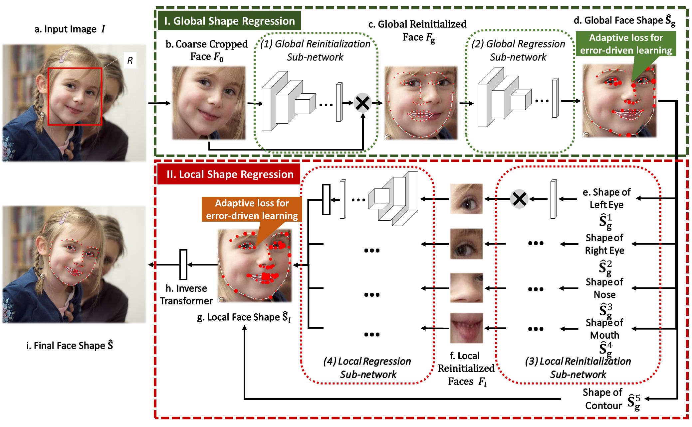

# FaceAlignmentDPR 

## Introduction
This is the example of the testing code corresponding with our recently TPAMI accepted paper **"Robust Face Alignment via Deep Progressive Reinitialization and Adaptive Error-driven Learning"**.

## Brief description of our method
Since different face detectors provide face bounding boxes with different scales and center shifts, see the following figure (a), they impose great difficulties to face alignment for face shape modeling and learning. Regression-based face alignment algorithms learn to predict the landmark locations provided by some human annotators in the benchmarks. However, there is no uniform annotation protocol for landmark positions, these landmark annotations usually exhibit significant variations in different benchmarks, as shown in the following figure (b).


To deal with the above two issues, we present a novel deep architecture with progressive reinitialization and adaptive error-driven learning to obtain high-performance face alignment results (see the following figure). The resulting deep architecture permits training from end to end and produces accurate and robust facial alignments.



## Requirement
* Python >= 3.6 
* PyTorch >= 0.4.1
* OpenCV (Python version >= 4.2)

## Installation structions
 pip install -r requirements.txt 
 
## Run the testing code
We have released two 98-landmark models based on our global/local regression stages, GSR$_\omega$ and G&LSR$_\omega$, whose learning are supervised by the landmark-weighted loss function on the WFLW training dataset.

When the environment is configured successfully, you can just download the code and run the following script:

`python demo_GSR.py` 

or 

`python demo_GLSR.py` 

Then the face aligment results on several examples of the WFLW dataset can be obtained.

## Comments
#### Python Platform 
In our paper, the running speed of our method on GPU is evaluated on the  CAFFE platform. Considering the popularity of Pytorch, we select the Pytorch version instead.  For the CAFFE verison of the original two-stage reinitialization, you can refer to [our previous code](https://github.com/shaoxiaohu/Face_Alignment_Two_Stage_Re-initialization.git) if neccesary.

#### Local Regression Sub-network
In the current project, we employ the proposed Small MobileNetV2 to build the local regression sub-network. Thus it can be finetuned on the global regression model to streamline the training process. 

#### Trick of Image Transformation
We have injected the image and landmark transformation as independent layers to the whole network structure and make the model training in an end-to-end way, you can find more details by referring to the codes of st_lay.cpp and point_transformer_layer.cpp at [our previous code](https://github.com/shaoxiaohu/Face_Alignment_Two_Stage_Re-initialization.git). In the currently released code, it is noted that the image and landmark transformation between the reinitialization and regression sub-networks is implemented outside of the network inference. The reason is that we find that the spatial transformation on the whole image instead of the faces and local parts can efficiently retain more valid texture information, and it can be seen as a trick to take full advantage of reinitialization parameters. 

#### Speed and Accuracy

| Model |NME(%)  | FR(%) |AUC|Speed*(ms)|
|--|--|--|--|--|
| GSRw |  5.35|  6.84 |0.4859   | 39 | 
| G&LSRw  | 5.08 |6.16   |0.5079   | 79  | 

* The symbol \* denotes that the running speed is evaluated at the device with the Nvidia P100 GPU and the Intel Xeon(R) CPU E5-2682 v4 @ 2.50GHz CPU.

Because of the usage of the Small MobileNetV2 in the local stage, G&LSRw achieves better NMEs and AUC performance on WFLW than that reported in our journal paper. Limited by the non-optimized memory management of Pytorch, the released code on GPU has a slower speed, while the same models GSRw and G&LSRw implemented by MNN on iPhone 6S cost only about 7 ms and 13.6 ms, respectively.

## Moblie demo
We have also released a 106-landmark model based on our architecture. It is implemented by the MNN framework, and please refer to [106-landmark model](https://github.com/alibaba/MNNKit/blob/master/doc/FaceDetection_CN.md).

### Citation
```
If you find this work helpful, please cite it as follows，

@inproceedings{shao2021robust,  
  title={Robust Face Alignment via Deep Progressive Reinitialization and Adaptive Error-driven Learning},  
  author={Shao, Xiaohu and Xing, Junliang and Lyu, Jiangjing and Zhou, Xiangdong and Shi, Yu and Maybank, Steve},  
  journal={IEEE Transactions on Transactions on Pattern Analysis and Machine Intelligence},  
  year={2021}  
 }

@inproceedings{lv2017twostage,  
  title={A Deep Regression Architecture with Two-Stage Re-initialization for High Performance Facial Landmark Detection},  
  author={Lv, Jiangjing and Shao, Xiaohu and Xing, Junliang and Cheng, Cheng and Zhou, Xi},  
  booktitle={Proceedings of the IEEE conference on computer vision and pattern recognition}, 
  pages = {3691--3700},  
  year={2017}  
 }
```

### Licence
This code is distributed under MIT LICENSE.

### Contact
Please contact us if you have any problems during the demo running: <br> 

shaoxiaohu at gmail dot com <br>

lvjiangjing12 at gmail dot com <br>

jlxing at nlpr dot ia dot ac dot cn <br>
